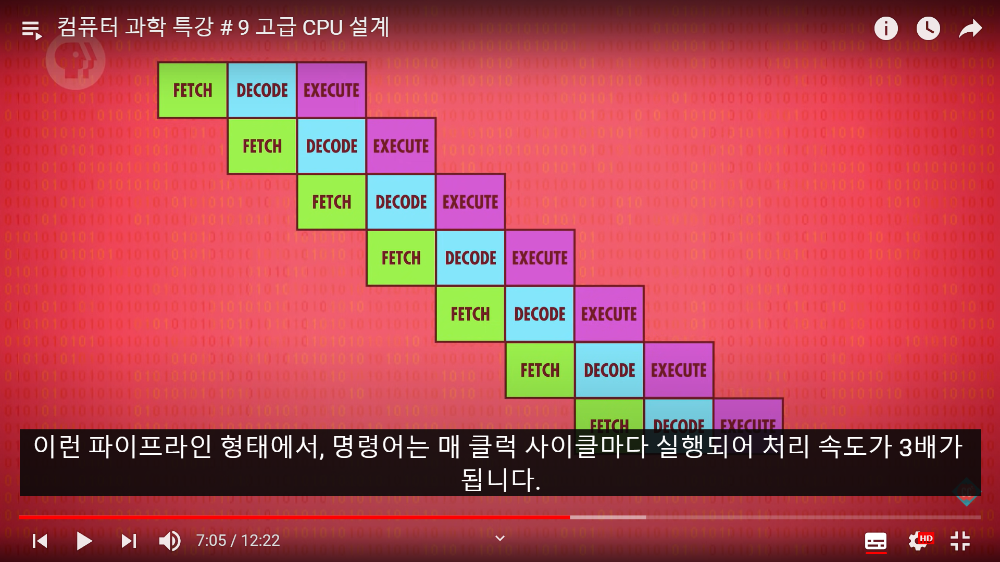

### 복잡도와 속도 사이의 TradeOff
컴퓨터가 발달함에 따라 처리할 수 있는 명령어의 집합이 커졌다. 1971년에는 46개에 불과했던 명령어가(Intel 4004) 오늘날에는 수천개에 이른다. 처리할 명령어가 많아지면(즉, 컴퓨터가 복잡해지면) 자연히 속도가 느려지기 마련이다. 이러한 문제를 해결하기 위해, 다양한 방법을 고안해냈다.

  

### 방법 1: Cache

CPU CHIP과 RAM은 BUS라는 선으로 연결되어 있다. 이 선을 통해서만 명령을 주고 받는다면 과부하가 올 수가 있다. 이를 해결하기 위해서, CACHE라는 작은 RAM 조각을 만들어서 CPU 안에 넣어준다.

그림에서 보는 바와 같이, RAM 에서는 데이터 블럭을 CACHE에 통째로 복사한다. CACHE는 프로세서에 붙어 있기 때문에, 데이터를 한 클럭 사이클에 보내줄 수 있다. 

CPU에서 요청한 데이터가 이미 CACHE에 있다면 이를 Cachehit라고 하며, 없으면 Cachemiss라고 한다.

#### Dirty Bit

데이터를 CACHE에 저장하게 되면, RAM에 기록한 사항과는 달라지게 된다. 발생한 불일치는 기록해두었다가 특정 시간에 동기화 해주어야 한다. 이를 위해, 캐쉬는 저장된 각 메모리 블럭에 대한 특별한 플래그가 있는데 이를 Dirty Bit이라고 한다. 캐쉬는 오래된 블럭을 지워서 공간을 확보하기 전에 dirty bit를 체크하고, 만약 dirty하다면 새 블럭을 옮겨오기 전에 우선 오래된 블록을 RAM에 옮겨준다.

  

### 방법 2 : 명령어 파이프라이닝

작업을 병렬로 처리하게 되면, 속도를 엄청나게 올릴 수 있다. 여태까지 배운 FETCH-DECODE-EXECUTE의 사이클은 각 사이클이 돌아야만 다음 사이클로 진행을 할 수 있었다. 생각해보면, 사이클의 각 부분은 CPU의 각기 다른 부분을 사용하기 때문에 병렬 처리가 가능하다.

병렬로 처리함에 따라, 데이터 의존성(한 명령이 다른 명령에 영향을 받는 경우)과 조건부 JUMP 명령어 문제(조건이 맞는지 아닌지 계속 따져보면서 진행해야 함)가 발생한다. 두 케이스 모두 파이프라인 수행 시간을 지연시키는 문제가 발생한다. 

데이터 의존성을 해결하기 위해서 비순차적 명령(순차적으로 진행되지 않아도 동적으로 명령 순서를 바꿔서 진행)이나 예측 실행(JUMP 명령어 조건이 맞을지 아닐지 여부를 미리 예측해서 작업 대기열에 올려놓음) 기법을 활욯안다. 

  

### 방법 3 : 멀티 코어 프로세스

하나의 CPU 칩 안에 여러 개의 독립적인 프로세싱 유닛이 들어가있다.

좀 더 확장해보면 컴퓨터에 여러 개의 독립된 CPU를 조립해버릴 수도 있다. 유튜브 데이터 센터에서 활용하는 대형 컴퓨터가 그렇고, 슈퍼 컴퓨터도 이 개념이라고 볼 수 있다.