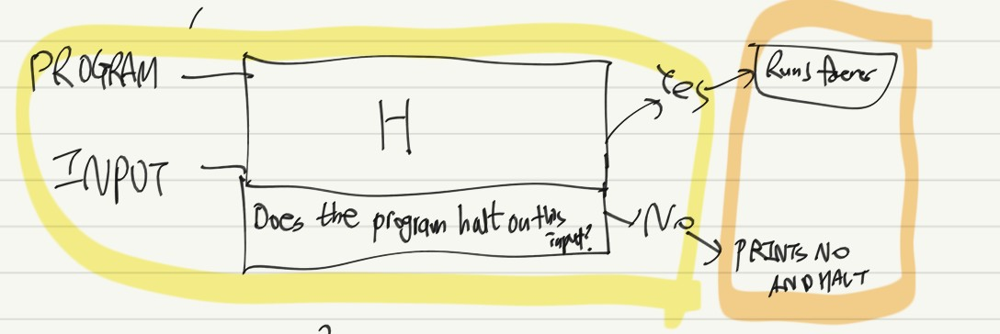

### 앨런 튜링

앨런 튜링은 CS(Computer Science)의 아버지라고 불린다. 그는 컴퓨터 과학의 개념 발전에 큰 기여를 했는데, 여기서는 튜링 머신, 정지 문제, 그리고 튜링 테스트에 대해 설명한다.

### 튜링 머신

튜링 머신은 이론적인(가상의) 계산 장치이다. 튜링 머신은 개념적으로 테이프와 작동 규칙으로 구성되어 있는데, 테이프가 돌아가면서 작동 규칙에 맞게 숫자를 찍어내는 구조이다. 그가 처음 제안했던 예시는 테이프에 찍힌 숫자의 개수가 홀수 개인지, 짝수 개인지 판별하는 프로그램이었다.

구체적으로 테이프에는 숫자 1이 찍혀있고, 테이프가 한 칸 한 칸 움직일 때마다 홀수/짝수 여부가 프로그램 내의 counter에 기록된다. 그리고 테이프의 마지막 칸에 도달하면, counter의 기록에 따라 홀수라면 1을, 짝수라면 0을 마지막 칸에 기록함으로써 전체 숫자의 갯수가 홀수 개인지, 짝수 개인지 알 수 있었다.

튜링 머신은 범용 컴퓨터(계산 기계)의 간단한 예제이지만, 충분한 규칙(작동 규칙)과 테이프로 무엇이든지 만들어 낼 수 있었기 때문에 컴퓨터의 가능성을 보여준 가상 사례 연구라고 할 수 있다.

### 정지 문제

그렇다면, 튜링 머신에 설명과 테이프만 주어진다면 이 프로그램은 영원히 실행될 것인가? 아니면 멈출 것인가? 얼핏 보면 이 문제는 단순한 논리 수수께끼 같지만, 이보다는 더욱 큰 의미를 함축하고 있었다. 어떤 의미냐면, 컴퓨터가 '어떤 문제든 해결할 수 있는지(전지전능한지)'에 대해서 증명하는 문제였던 것이다. 이 문제를 정지 문제라고 하는데, 튜링은 이 문제에 대해서도 간단하면서도 탁월한 해결책을 제시했다.

그림과 같은 기계가 있다고 하자. 노란색 형광펜 영역은 Halting Machine이라는 기계이다. Halting Machine은 특정 input을 집어넣었을 때, 이 프로그램이 멈추는 지를 판별하는 기계이다. 그러므로 Yes라면 멈출 것이고, No라면 계속해서 돌아갈 것이다. 이제 이 기계 뒷단에, 주황색 형광펜 영역을 붙여보자. 원래 기계 동작과 반대로,Yes(프로그램이 멈춘다)라면 영원히 돌아가게(Runs Forever), 반대로 No(프로그램이 안 멈춘다)라면 No를 출력하고 멈추게끔 만들어버리는 기계를 만들었다. 저 그림 전체를 합친 기계를 Bizarro라고 해보자.

그렇다면 Bizarro가 Input으로 자기 자신, Bizarro를 받는다고 가정해보자. Bizarro는 Halting Machine으로 먼저 들어가서, Bizarro가 멈추게 할 지 여부를 판별한다. 여기서부터 얘기가 조금 복잡해지는데, 최대한 단순하게 생각해야 한다. 

* Bizarro를 Halting Machine에 집어넣어서 멈춘다고 판별하면, Bizarro는 Runs Forever에 들어가서 멈추지 않을 것이다.

* Bizarro를 Halting Machine에 집어넣어서 멈추지 않는다고 판별하면, Bizarro는 Prints No and Halt로 들어가서 멈추게 될 것이다.

두 케이스 모두, Halting Machine의 판별과 반대로 작동하기 때문에, 모순이 생긴다. 그러므로 Bizarro는 Bizarro 그 자체의 정지 문제를 해결할 수 없다.

즉, 튜링 머신으로는 정지 문제를 해결할 수가 없다는 결론에 이르게 된다. 정지 문제를 해결할 수 없다는 것은, 컴퓨터는 모든 문제를 해결할 수는 없음을 보여주는 증거이다. 즉, 컴퓨터가 많은 문제를 해결할 수 있으되, 모든 문제를 해결할 수는 없음을 보인 것이다.

### 그 밖의 업적
튜링은 암호 해독에도 큰 기여를 했다. 2차 세계대전 당시 독일군은 에니그마라는 암호 체계를 활용해 교신을 주고 받았는데, 튜링은 연합군 측에서 일하며 독일군의 암호를 풀어내는 데 큰 기여를 했다. 

전쟁 이후에는 인공지능 분야에도 기념비적인 역할을 했다. 튜링 테스트라는 개념을 제시한 것인데, 간단하게 얘기해서 어떤 문제를 던졌을 때 컴퓨터와 사람이 각각 구별될 수 없을만큼 유사한 답을 내놓는다면 컴퓨터는 사람 만큼의 지능을 갖고 있는 것으로 판단된다. 이 튜링 테스트라는 개념은 오늘날 스팸 방지 문자 기능으로도 활용되는데, 컴퓨터가 답을 내놓을 수 없는(사람만 올바른 답을 내놓을 수 있는) 문제를 내서 이 사이트에 접속한 사용자가 자동 기계인지 아닌지 판별할 수 있게 되는 것이다.

### 참고 자료
https://www.youtube.com/watch?v=7TycxwFmdB0 Crashcourse Computer Science 15강 : 앨런 튜링